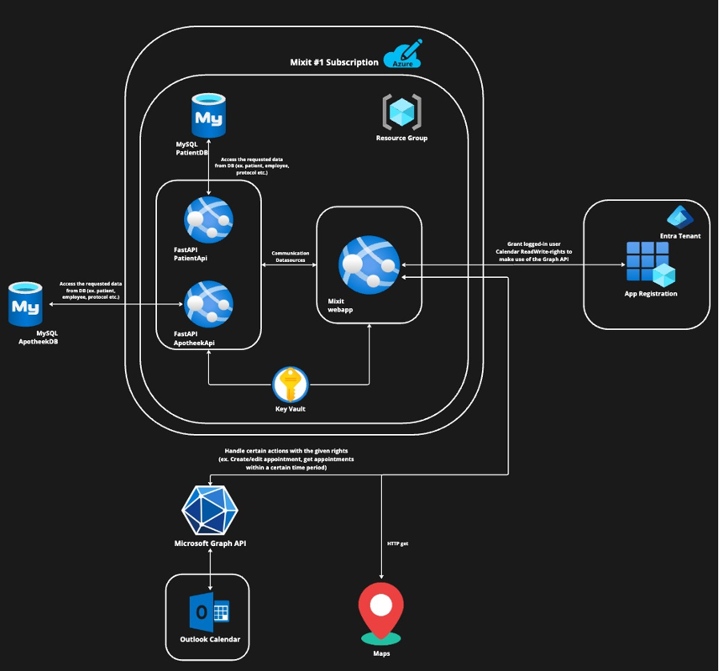
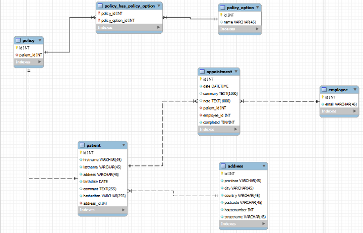
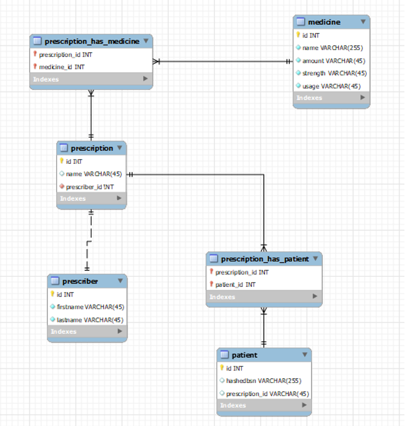

### MixIT 소개

MixIT는 의료 정보를 신속하게 통합하고 공유하여 의료진의 업무 효율을 극대화하는 의료 정보 교환 및 통합 플랫폼입니다.

### 서비스 설명

이 기술은 의료진이 환자의 요약 정보를 신속하게 접근하고, 스케줄 변동을 즉각적으로 파악하며, 중요한 의료 절차를 일관되게 관리할 수 있도록 지원합니다.

MixIT는 응답성이 높고 통합된 의료 환경 구축을 목표로, 의료 기록의 자동 연동과 표준화된 프로토콜을 통해 환자 치료의 질을 향상시키고, 의료 전문가의 업무 부담을 줄여 미래 의료의 발전에 기여할 전망입니다.

### 핵심 기능

-   환자 정보를 빠르게 제공하는 통합 조회 시스템입니다.
-   환자 스케줄 변동 시 즉시 알림을 받는 기능입니다.
-   의료진의 방문 기록과 약속 스케줄링을 자동화합니다.
-   침대 교체 같은 반복적인 작업을 위한 표준 프로토콜을 적용합니다.

### 서비스 아키텍쳐

### ERD

**환자 데이터베이스**
 

 

**약국 데이터베이스**

